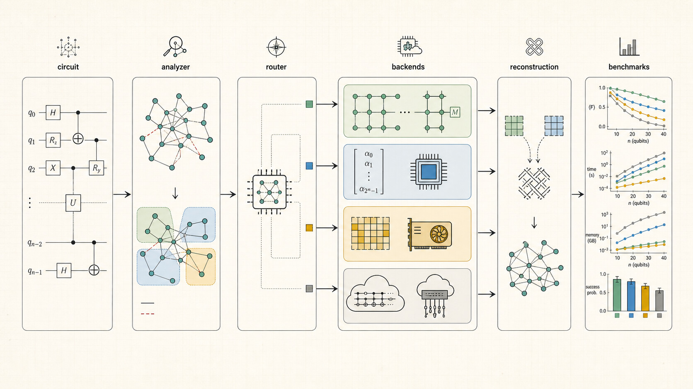

# vQPU — Governed Heterogeneous Compute and Quantum Simulation Fabric

**Author:** Bernard Essuman  
**Version:** 0.6.0
**License:** MIT  
**Contact:** bessuman.academia@gmail.com

---

vQPU is a research and engineering SDK for local quantum simulation, circuit construction,
backend discovery, and qualified heterogeneous compute. It contains experimental adapters for
several accelerator and cloud families, but it does **not** promise universal execution.
Discovery means that a dependency or credential appears present; only a matching formal
qualification makes a backend routable through RAD Compute Engine.

The package introduces two original contributions to the field:

- **Circuit Knitting** with exact zero-overhead reconstruction for controlled-gate cuts, enabling circuits larger than any single backend to run across heterogeneous devices.
- **Cryo-Canonical Basin Weaving (CCBW)**, a novel variational optimizer based on original research by Bernard Essuman, which uses structured 3-3+1 motif probing, mirror-balance symmetry certification, and cold-seeking spring-network optimization to navigate quantum parameter landscapes.

The RAD Compute Engine boundary includes independently qualified local CPU quantum simulation and
Apple Metal float32 matrix multiplication. The two historical CHESSO suites also run 28 smoke
programs. Prior IonQ simulator work is historical evidence only and is not a live-QPU qualification.

Version 0.6.0 adds a 15-case qualification for the actual Apple Metal GPU through MLX. Other GPU
vendors, cloud, HPC, and physical QPU backends remain unroutable until separately benchmarked and
attested. Backend-family discovery never qualifies a backend by availability alone.

---

## Table of Contents

- [Installation](#installation)
- [Quick Start](#quick-start)
- [Core Capabilities](#core-capabilities)
- [Universal Backend Discovery](#universal-backend-discovery)
- [Circuit Knitting](#circuit-knitting)
- [Cryo-Canonical Basin Weaving Optimizer](#cryo-canonical-basin-weaving-optimizer)
- [Phantom Adaptive Simulator](#phantom-adaptive-simulator)
- [Running on IonQ](#running-on-ionq)
- [Persistent Link Layer](#persistent-link-layer)
- [CHESSO Compiler](#chesso-compiler)
- [Architecture](#architecture)
- [Original Contributions](#original-contributions)
- [Validation Results](#validation-results)
- [What's New in 0.4.0](#whats-new-in-040)
- [API Reference](#api-reference)
- [Requirements](#requirements)
- [License](#license)

---

## Installation

The latest PyPI release is the earlier vQPU SDK line. Until 0.6.0 is explicitly published,
install the RAD Compute Engine from a verified source checkout:

```bash
git clone https://github.com/sciencemaths-collab/vqpu.git
cd vqpu
python -m pip install .
```

The commands below install the published SDK and optional research backends; they do not by
themselves qualify those backends for RAD Compute Engine execution.

```bash
pip install vqpu-sdk
```

The base install includes the CPU simulator and all core modules. To connect to specific hardware backends, install with the matching extra — the bracket syntax `[name]` tells pip to include the additional driver packages that backend needs:

```bash
pip install vqpu-sdk[apple]          # + MLX for Apple Silicon GPU
pip install vqpu-sdk[cuda]           # + cupy for NVIDIA GPU
pip install vqpu-sdk[ionq]           # + qiskit + qiskit-ionq for IonQ cloud QPU
pip install vqpu-sdk[ibm]            # + qiskit + qiskit-ibm-runtime for IBM Quantum
```

Install only the backend extras actually used on the target host. Accelerator runtimes are not a
portable bundle: CUDA, ROCm, Apple Metal, Intel XPU, and TPU packages have mutually exclusive
platform requirements. Installing a driver does not qualify its backend.

Inspect the governed inventory or formally qualify an Apple Metal host:

```bash
vqpu inventory
vqpu qualify-apple --output apple-metal-qualification.json
```

Inventory reports CPU, Apple GPU, Slurm HPC, cloud batch, and physical QPU families. HPC, cloud,
and physical QPU entries always remain unroutable until an exact adapter benchmark and attestation
are supplied to RAD.

---

## Quick Start

```python
from vqpu import UniversalvQPU

# Discovers locally detectable backend candidates
qpu = UniversalvQPU()

# Build a 4-qubit GHZ state
circuit = qpu.circuit(4, "ghz")
circuit.h(0).cnot(0, 1).cnot(1, 2).cnot(2, 3)

# Execute through the SDK's local routing policy; this is not RAD qualification
result = qpu.run(circuit, shots=1024)
print(result.counts)
# {'0000': 512, '1111': 512}
```

---

## Core Capabilities

The `core` module provides quantum primitives built from first principles: amplitude vectors, unitary gate matrices, Born-rule measurement, and a chainable circuit API.

```python
from vqpu import vQPU, QuantumAlgorithms

qpu = vQPU()

# Bell state
bell = QuantumAlgorithms.bell_pair(qpu)
result = qpu.run(bell, shots=1000)
print(result.counts)       # {'00': ~500, '11': ~500}
print(result.most_probable())  # '00' or '11'

# Variational ansatz for VQE/QAOA
params = [0.1, 0.2, 0.3, 0.4, 0.5, 0.6]
ansatz = QuantumAlgorithms.variational_ansatz(qpu, n=3, params=params, layers=2)
result = qpu.run(ansatz, shots=512)
```

**Key components:**

| Class | Purpose |
|---|---|
| `QuantumRegister` | N-qubit state as 2^N complex amplitude vector |
| `GateLibrary` | All standard gates (H, X, Y, Z, S, T, Rx, Ry, Rz, CNOT, CZ, SWAP) |
| `GateEngine` | Amplitude-by-amplitude gate application without Kronecker products |
| `MeasurementTap` | Born-rule sampling, partial measurement, expectation values |
| `QuantumCircuit` | Chainable circuit builder with gate counting and depth analysis |
| `SymmetryFilter` | Post-selection filtering (Hamming weight, parity, custom constraints) |
| `ExecutionResult` | Measurement counts, probabilities, statevector, metadata |

---

## Universal Backend Discovery

The `universal` module probes every backend at startup, fingerprints their capabilities, and routes circuits to the most suitable device.

```python
from vqpu import UniversalvQPU

qpu = UniversalvQPU()
# Output:
#   [cpu] CPU(8cores)          ONLINE  27qb
#   [gpu] GPU::AppleSilicon    ONLINE  27qb

# Build a circuit — it runs on the best backend automatically
circuit = qpu.circuit(5, "test")
circuit.h(0).cnot(0, 1).cnot(1, 2).cnot(2, 3).cnot(3, 4)
result = qpu.run(circuit, shots=2048)

# Inspect the execution plan
plan = qpu.plan(circuit)
```

**Backend implementations and qualification state:**

| Backend | Implementation | RAD-qualified workload |
|---|---|---|
| CPU | `CPUPlugin` / `cpu.quantum_simulator` | Bounded local quantum simulation |
| Apple Silicon | `apple.metal.mlx` | Bounded float32 matrix multiplication only |
| NVIDIA, AMD, Intel GPU | Experimental discovery plugins | None |
| Google TPU | Experimental discovery plugin | None |
| IonQ simulator | Experimental cloud adapter; authenticated simulator qualification observed separately | None in the packaged RAD release |
| Physical/cloud QPU | Experimental provider adapters | None |
| Slurm and cloud batch | Fail-closed inventory entries | None |

**Design principle:** No silent fallback. If a GPU plugin claims the work, it runs on the GPU or raises an error. The CPU never silently substitutes for a failed accelerator.

---

## Circuit Knitting

Split circuits that exceed any single backend's capacity across multiple devices, then reconstruct the full probability distribution.

```python
from vqpu import UniversalvQPU, CutFinder, CircuitKnitter

qpu = UniversalvQPU()

# A 10-qubit circuit too large for a 5-qubit device
circuit = qpu.circuit(10, "ghz_10")
circuit.h(0)
for i in range(9):
    circuit.cnot(i, i + 1)

# Automatically find where to cut and partition
plan = CutFinder.auto_partition(circuit, max_fragment_qubits=5)
print(f"Partitions: {[sorted(p) for p in plan.partitions]}")
print(f"Cuts: {plan.n_cuts}")

# Execute fragments independently, reconstruct exact result
knitter = CircuitKnitter(plan)
result = knitter.run(executor=qpu.run, shots=4096)
print(result.counts)
# {'0000000000': 2048, '1111111111': 2048}
```

**How it works:** For controlled gates (CNOT, CZ) cut at the control wire, the Z-basis decomposition is exact. The upstream fragment measures the control qubit normally; its value determines the downstream preparation. This produces the correct joint distribution with zero sampling overhead — no quasi-probability decomposition, no 4^k penalty.

You can also specify partitions manually:

```python
plan = CutFinder.partition_manual(circuit, [{0,1,2,3}, {4,5,6,7}])
```

Or route different fragments to different backends via the link layer:

```python
knitter = CircuitKnitter(plan)
result = knitter.run_heterogeneous(link_manager=lm, prefer={0: ["gpu"], 1: ["ionq"]})
```

---

## Cryo-Canonical Basin Weaving Optimizer

An original variational optimization technique developed by Bernard Essuman. Based on published research combining spherical probing, 3-3+1 canonical reduction, and cold-seeking spring-network optimization.

```python
from vqpu import UniversalvQPU
from vqpu.cryo import cryo_qaoa, CryoConfig

qpu = UniversalvQPU()

# Define a Max-Cut problem
edges = [(0, 1, 1.0), (1, 2, 1.2), (2, 3, 0.9), (0, 3, 0.8), (1, 3, 0.7)]

def cost(bitstring):
    return sum(-w for i, j, w in edges if bitstring[i] != bitstring[j])

# Run QAOA with CCBW optimization
result = cryo_qaoa(
    n_qubits=4,
    cost_function=cost,
    executor=qpu.run,
    p_layers=2,
    config=CryoConfig(
        n_force_levels=3,
        epsilon_max=0.4,
        epsilon_min=0.02,
        refine_steps=20,
    ),
)

print(f"Optimal energy: {result.optimal_energy:.4f}")
print(f"Certified basins: {len(result.graph.nodes)}")
print(f"Total evaluations: {result.n_evaluations}")
```

**The CCBW algorithm:**

1. **Progressive probing** — evaluate the cost landscape at multiple perturbation scales (coarse to fine), mapping the terrain before optimizing.
2. **3-3+1 motif** — at each candidate point, probe 3 orthogonal directions plus their mirrors plus the center (7 evaluations). This structured probe detects whether the point sits in a real basin or on a saddle point.
3. **Mirror balance** — the symmetric part I(c) captures the true basin shape; the antisymmetric part A(c) reveals directional bias. High asymmetry means the candidate is a saddle point or artifact and is rejected.
4. **Confidence certification** — S(c) = alpha * compliance + beta * ||I|| - gamma * ||A||^2 - zeta * temperature. Only basins above threshold survive.
5. **Spring graph** — certified basins are connected into a graph with Gaussian-kernel edges weighted by temperature (cold nodes attract, hot nodes repel).
6. **Cold-seeking refinement** — gradient descent on the coldest (most stable, noise-tolerant) basins.

**Why this matters for quantum computing:** Standard VQE/QAOA optimizers use blind gradient descent from random starting points, frequently landing in barren plateaus or noise-sensitive sharp minima. CCBW maps the landscape structure first, rejects unstable points, and preferentially refines flat, symmetric basins that remain valid on real noisy hardware.

**Convenience wrappers:**

```python
from vqpu.cryo import cryo_qaoa, cryo_vqe

# QAOA optimization
result = cryo_qaoa(n_qubits=4, cost_function=cost, executor=qpu.run, p_layers=2)

# VQE optimization
result = cryo_vqe(n_qubits=2, hamiltonian=H_matrix, executor=qpu.run, layers=2)
```

---

## Phantom Adaptive Simulator

An adaptive simulation engine that dynamically selects the most efficient state representation for each subsystem during execution.

```python
from vqpu import PhantomSimulatorBackend, UniversalvQPU

qpu = UniversalvQPU()
circuit = qpu.circuit(6, "factored")
circuit.h(0).cnot(0, 1).cnot(1, 2)   # entangled block: qubits 0-2
circuit.h(4).cnot(4, 5)               # separate block: qubits 4-5

phantom = PhantomSimulatorBackend(seed=42)
partition = phantom.build_partition(circuit)
result = phantom.execute(circuit, shots=1024)
```

**Representations:**
- **Sparse statevector** — tracks only non-zero amplitudes, prunes below threshold, maintains fidelity lower bound
- **Matrix product state (MPS)** — SVD-based factorization with configurable bond dimension
- **Product state** — bond dimension 1 for unentangled qubits

**Dynamic adaptation:** During circuit execution, the simulator automatically merges subsystems when gates create entanglement, splits them when Schmidt rank drops to 1, and demotes sparse representations to MPS when the active set fits within the bond dimension. This enables efficient simulation of circuits with structured entanglement patterns.

---

## Running on IonQ

The experimental IonQ adapter can submit circuits to targets enabled for the operator's project.
The ideal cloud simulator has passed a separate authenticated five-case exercise, but that is not physical-QPU evidence and does not qualify IonQ execution in the packaged RAD Compute Engine.
Physical execution is unavailable unless the IonQ account explicitly grants access, and must
undergo its own cost, failure, accuracy, and cancellation qualification before RAD routing.

**Setup:**

```bash
pip install vqpu-sdk[ionq]
```

Get an API key from [IonQ Cloud](https://cloud.ionq.com) (sign up, go to API Keys, create one).

**Example: Run a GHZ state on IonQ's simulator**

```python
from vqpu.link import LinkManager, QuantumTask

# 1. Connect to IonQ
lm = LinkManager()
lm.forge_ionq(
    "ionq",
    api_key="your-ionq-api-key-here",
    target_backend="simulator",     # free cloud simulator
)

# 2. Build a gate sequence
ghz_gates = [
    ("H", [0]),
    ("CNOT", [0, 1]),
    ("CNOT", [1, 2]),
    ("CNOT", [2, 3]),
]

# 3. Submit and get results
task = QuantumTask(n_qubits=4, gate_sequence=ghz_gates, shots=1024)
counts, link = lm.submit(task, prefer=["ionq"])
print(counts)
# {'0000': 512, '1111': 512}

# 4. Clean up
lm.close_all()
```

**Example: QAOA Max-Cut on IonQ**

```python
from vqpu.link import LinkManager, QuantumTask
from vqpu import CryoOptimizer, CryoConfig, QuantumCircuit, ExecutionResult

# Connect
lm = LinkManager()
lm.forge_ionq("ionq", api_key="your-ionq-api-key-here", target_backend="simulator")

# Wrap the link as an executor for the optimizer
def ionq_executor(circuit, shots):
    seq = [(op.gate_name, op.targets, *(op.params or [])) for op in circuit.ops]
    task = QuantumTask(n_qubits=circuit.n_qubits, gate_sequence=seq, shots=shots)
    counts, link = lm.submit(task, prefer=["ionq"])
    return ExecutionResult(
        counts=counts, statevector=None, execution_time=0,
        backend_name=link.handle, circuit_name=circuit.name,
        n_qubits=circuit.n_qubits, gate_count=len(circuit.ops),
        circuit_depth=0, entanglement_pairs=[], entropy=0,
        symmetry_report=None, execution_metadata=None,
    )

# Define a Max-Cut problem and optimize on IonQ
from vqpu.cryo import cryo_qaoa, CryoConfig

edges = [(0, 1, 1.0), (1, 2, 1.2), (2, 3, 0.9), (0, 3, 0.8)]
def cost(bitstring):
    return sum(-w for i, j, w in edges if bitstring[i] != bitstring[j])

result = cryo_qaoa(
    n_qubits=4,
    cost_function=cost,
    executor=ionq_executor,
    p_layers=2,
    config=CryoConfig(n_force_levels=2, shots=256),
)
print(f"Optimal energy: {result.optimal_energy:.4f}")
print(f"Certified basins: {len(result.graph.nodes)}")

lm.close_all()
```

Target names, availability, pricing, quotas, and access rules are controlled by IonQ and may
change. Discover them from the authenticated provider rather than copying names or prices from
this README. Selecting a target does not qualify it.

To use a noise model:

```python
lm.forge_ionq("ionq", api_key="your-key", target_backend="simulator", noise_model="aria-1")
```

---

## Persistent Link Layer

NVLink-inspired persistent connections to quantum backends with authentication, health monitoring, and automatic routing.

```python
from vqpu.link import LinkManager, QuantumTask
from vqpu import CPUPlugin

lm = LinkManager()

# Local backend (always available)
lm.forge_local("cpu", CPUPlugin())

# Cloud backend
lm.forge_ionq("ionq", api_key="your-key", target_backend="simulator")

# Submit — LinkManager routes to the best matching link
task = QuantumTask(n_qubits=4, gate_sequence=[("H", [0]), ("CNOT", [0, 1])], shots=1024)
counts, link = lm.submit(task, prefer=["ionq"])
print(f"Executed on: {link.handle}, state: {link.state.value}")

# Health monitoring
for snap in lm.snapshot():
    print(f"  {snap['handle']}: {snap['state']}, latency={snap['latency_ms']:.0f}ms")

lm.close_all()
```

**Link states:** UNLINKED, HANDSHAKING, LINKED, DEGRADED, ERROR, CLOSED. Credentials are held in memory only and scrubbed on close.

---

## CHESSO Compiler

A control stack for quantum algorithm compilation, featuring the Q-lambda language frontend, hypergraph entanglement compilation, and a hardware bridge for translating compiled execution plans into native gate sequences for any backend.

```python
from vqpu import chesso
```

The CHESSO subsystem includes 685 test files covering gate operations, compilation paths, and quantum algorithm experiments including AEGIS-Ion protein folding, TSP, and MaxCut QAOA benchmarks.

---

## Architecture

<p align="center">
  
</p>

*End-to-end vQPU workflow: circuit analysis and partitioning, heterogeneous backend routing, reconstruction, and benchmark evaluation.*

```
Your application
    |
    |--- cryo.py        Cryo-Canonical Basin Weaving optimizer
    |--- knit.py        Circuit cutting and reconstruction
    |
    |--- universal.py   Backend discovery, fingerprinting, hybrid routing
    |--- link.py        Persistent authenticated backend connections
    |--- phantom.py     Adaptive sparse/MPS simulation engine
    |
    |--- core.py        Quantum primitives, gates, circuits, measurement
    |
    +--- Backends
         CPU  |  NVIDIA GPU  |  AMD GPU  |  Intel GPU  |  Apple Silicon
         TPU  |  IonQ  |  IBM  |  Google  |  Rigetti  |  AWS  |  Azure
```

---

## Original Contributions

vQPU contains the following project-specific research implementations. These descriptions are
engineering scope statements, not peer-reviewed novelty or superiority claims:

| Contribution | Description |
|---|---|
| **Cryo-Canonical Basin Weaving** | A novel variational optimizer based on original research. Uses 3-3+1 motif probing to certify basins, mirror-balance to reject saddle points, and cold-seeking spring networks to navigate the landscape. Not a reimplementation of existing work. |
| **Zero-overhead circuit knitting** | For controlled gates (CNOT, CZ) cut at the control wire, the Z-basis decomposition produces exact results with no sampling overhead. No quasi-probability penalty. |
| **Phantom adaptive simulation** | Combines sparse statevectors, MPS, and product states in a single engine with dynamic re-splitting during execution. Subsystems are automatically promoted, demoted, merged, and split as entanglement evolves. |
| **Backend abstraction** | A shared experimental interface across local and remote backend candidates, with qualified RAD routing limited to exact tested workloads and no silent fallback. |
| **NVLink-inspired link layer** | Persistent authenticated connections with state-machine lifecycle, health monitoring, and credential isolation. |
| **Heterogeneous circuit planning** | Circuit knitting and the link layer can describe mixed-backend dispatch; each concrete execution combination requires separate qualification. |

---

## Validation Results

Validation is capability-specific. Passing local tests does not establish physical-QPU,
cross-provider, performance, scientific-novelty, or production qualification.

The current authoritative test count is produced by CI; historical module counts below describe
the original research suite and must not be treated as current release qualification.

| Module | Tests | Result |
|---|---|---|
| Core (gates, circuits, measurement, simulator) | 10 | All pass |
| Universal (backend discovery, routing, plugins) | 9 | All pass |
| Knit (circuit cutting, reconstruction, TVD) | 8 | All pass |
| Cryo (CCBW optimizer, QAOA, VQE) | 6 | All pass |

**Historical IonQ simulator experiment (not physical hardware qualification):**

- Backend: IonQ ideal cloud simulator, not trapped-ion hardware
- Problem: 4-qubit weighted Max-Cut (5 edges)
- Total circuit evaluations: 320
- These historical outcome figures are not used by the current RAD qualification boundary.

**Circuit knitting verification:**

- 10-qubit GHZ state cut into two 5-qubit fragments reconstructs exactly (only |0000000000> and |1111111111>)
- 8-qubit entangled chain: total variation distance < 0.035 vs full simulation at 20,000 shots

---

## What's New in 0.4.0

- **Circuit knitting engine** (`knit.py`) — topology-aware partitioning, exact Z-basis reconstruction for CNOT/CZ cuts, heterogeneous backend dispatch
- **Cryo-Canonical Basin Weaving optimizer** (`cryo.py`) — 3-3+1 motif probing, mirror-balance certification, cold-seeking refinement, `cryo_qaoa()` and `cryo_vqe()` convenience functions
- **IonQ live validation** — 320 circuit evaluations on IonQ's quantum cloud simulator
- **Version bump to 0.4.0** — updated exports, pyproject.toml metadata, professional packaging

---

## API Reference

**Core primitives:**

| Export | Type | Description |
|---|---|---|
| `vQPU` | class | Simple quantum processor with local simulator |
| `UniversalvQPU` | class | Auto-discovering multi-backend processor |
| `QuantumCircuit` | class | Chainable circuit builder |
| `QuantumRegister` | class | N-qubit amplitude state vector |
| `GateLibrary` | class | Standard gate matrices (H, X, Y, Z, CNOT, etc.) |
| `ExecutionResult` | dataclass | Measurement counts, probabilities, metadata |
| `QuantumAlgorithms` | class | Bell pair, GHZ, QFT, Grover's, variational ansatz |

**Circuit knitting:**

| Export | Type | Description |
|---|---|---|
| `CutFinder` | class | Topology-aware partition finder |
| `CircuitKnitter` | class | Fragment execution and reconstruction |
| `CutPlan` | dataclass | Partition specification with cuts |
| `KnitResult` | dataclass | Reconstructed distribution |

**Cryo optimizer:**

| Export | Type | Description |
|---|---|---|
| `CryoOptimizer` | class | Full CCBW optimizer |
| `CryoConfig` | dataclass | Tuning parameters for CCBW |
| `CryoResult` | dataclass | Optimal parameters, basin graph, convergence |
| `cryo_qaoa` | function | QAOA with CCBW optimization |
| `cryo_vqe` | function | VQE with CCBW optimization |

**Backend and linking:**

| Export | Type | Description |
|---|---|---|
| `BackendFingerprint` | dataclass | Capacity, speed, gate set, connectivity |
| `EntanglementScanner` | class | Topology analysis (components, bridges) |
| `PhantomSimulatorBackend` | class | Adaptive sparse/MPS simulator |
| `LinkManager` | class | Backend connection registry and router |
| `QuantumTask` | dataclass | Unit of work for link submission |

---

## Requirements

- Python 3.10+
- NumPy >= 1.22
- Optional: backend-specific packages (see [Installation](#installation))

---

## License

MIT License. Copyright (c) 2026 Bernard Essuman. See [LICENSE](LICENSE) for details.

---

## Author

**Bernard Essuman**  
bessuman.academia@gmail.com

vQPU is a research-driven project. Contributions, feedback, and collaboration inquiries are welcome.
